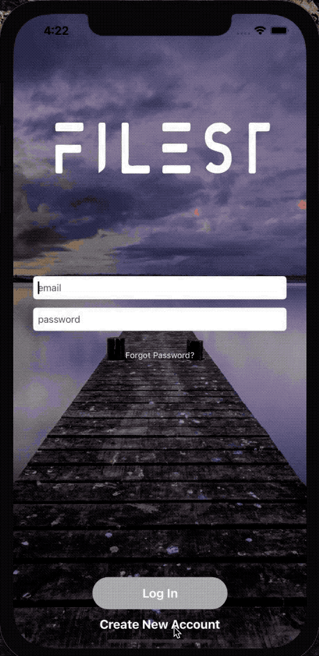
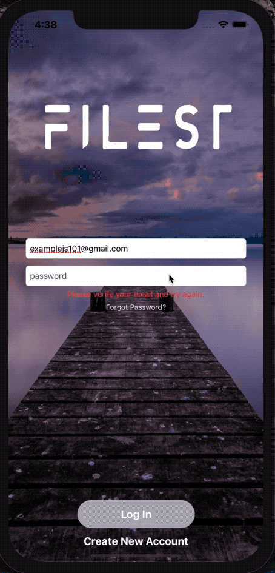
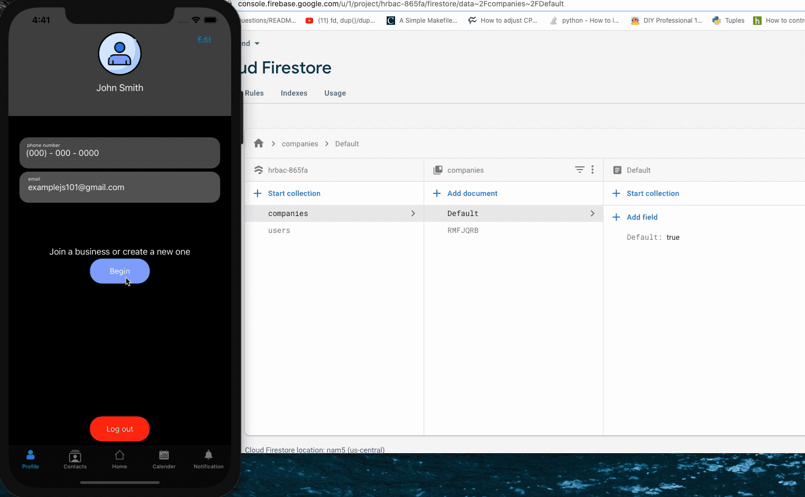
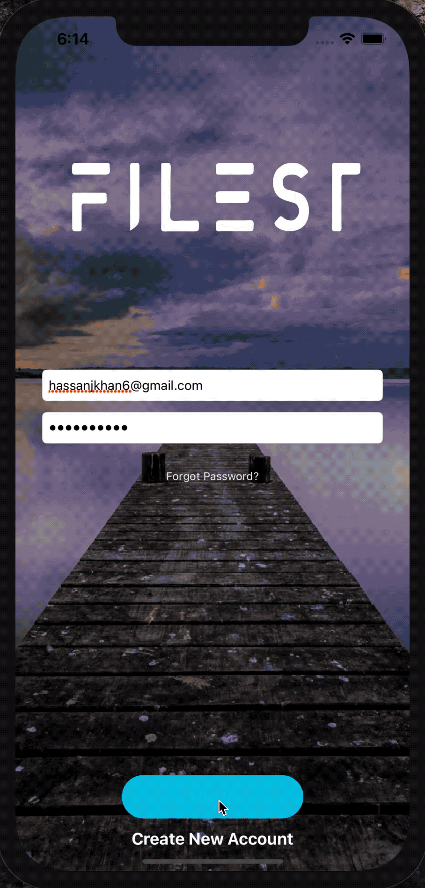
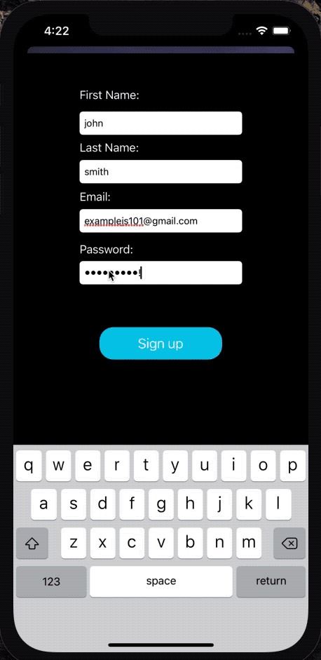
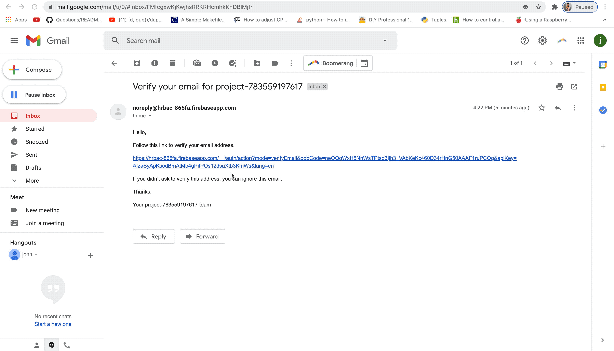
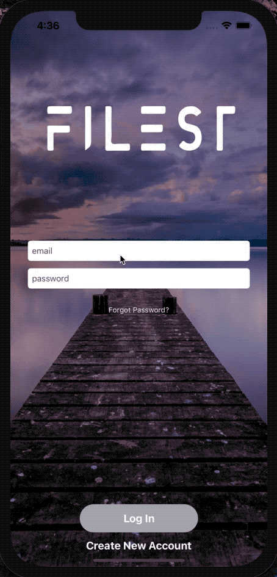

# Filest

### Description

Filest is a iOS application used to preform business tasks. Its purpose is to schedule meetings, request vacation days, and notify management of your absence if you are going to be missing work. When you first download the app you can use it to start a business, have other employees join with your code, and see them displayed on your contact list. I am currently undergoing the process of getting the app approved to be on published onto the App Store.

## 1. Signing Up Example

  

## 2. Log In Example

### After you have made your account and verified it you can log in.

  

## 3. Starting A New Business

### Here you can see that you must start a business or join one to begin using the app! You can also see in real time the business code being generated and saved in firebase.

## 4. Editing Profile

### After you have joined or started a business you can now edit your profile! It stores your basic information as well as your photo!

  

## 5. Contacts and Main Tab

### Once people have joined your business you can see them on your contacts list! Then in your Main tab you can preform company tasks.

  

## Extra: 

## Email Verification

### When you tap sign up you are alerted to open one of three mail apps that you may have. Tapping on one will open the app if you have it installed. You are also sent an email verification via firebase email verification. Once you verify your email you can then log into Filest! Yay!

- Here you can see the alert

  

- Here is the email verification

### Here is a working example of the correct username and password, but without verifying your email.

  

