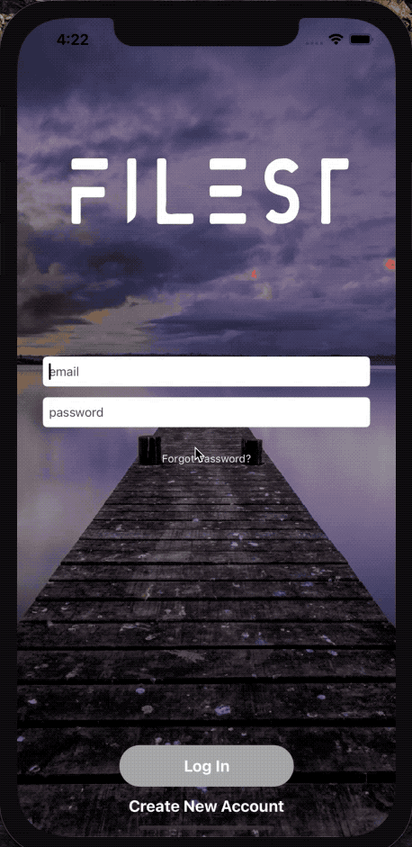

# Filest

## 1. Signing Up Example

{:height="50%" width="50%"}

## 2. Email Verification

When you tap sign up you are alerted to open one of three mail apps that you may have. Tapping on one will open the app if you have it installed. You are also sent an email verification via firebase email verification. Once you verify your email you can then log into Filest! Yay!

- Here you can see the alert

- Here is the email verification

## 3. Log In Example

After you have made your account and verified it you can log in.

## 4. Starting A New Business

Here you can see that you must start a business or join one to begin using the app! You can also see in real time the business code being generated and saved in firebase.

## 5. Editing Profile

After you have joined or started a business you can now edit your profile! It stores your basic information as well as your photo!

## 6. Contacts and Main Tab

Once people have joined your business you can see them on your contacts list! Then in your Main tab you can preform company tasks.

## Extra: 

-   Here is a working example of the correct username and password, but without verifying your email.

